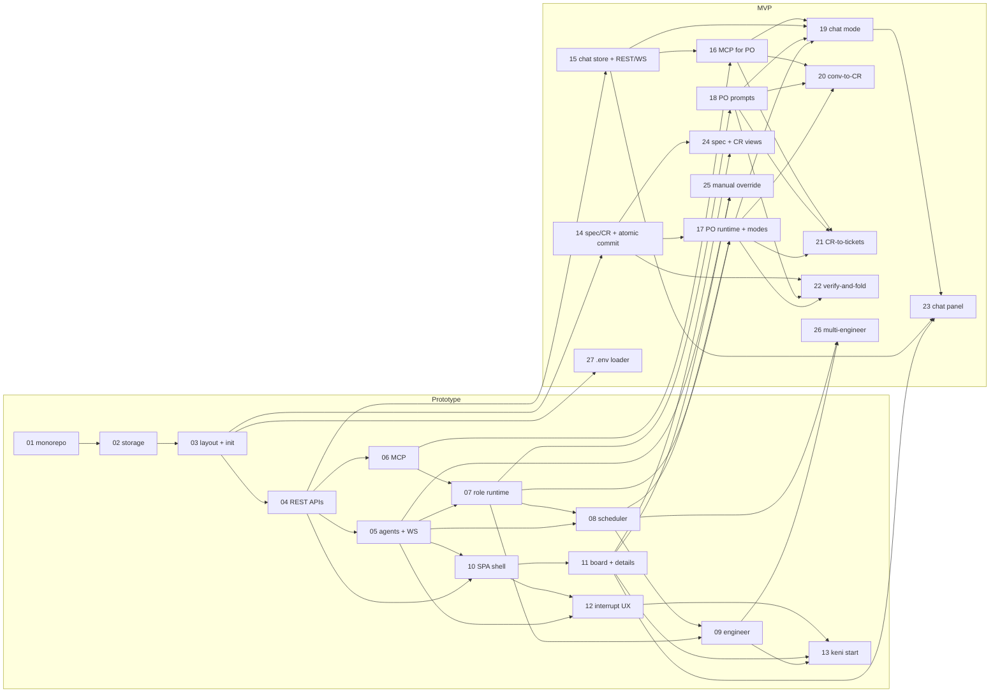

# Keni — Initial Implementation Plan

This folder breaks the [Keni Vision Spec](../spec.md) into 27 OpenSpec-ready change steps. Each numbered file is one self-contained step. The user runs them through `/opsx:propose` one at a time, in dependency order, to generate proposal/design/specs/tasks artifacts and then implement them.

## How to use a step file

Two ways:

1. **Run with the kebab-case name.** Each file's "Suggested change name" matches the filename's kebab portion. Example:

   ```text
   /opsx:propose setup-monorepo-and-tooling
   ```

   `/opsx:propose` will scaffold `openspec/changes/setup-monorepo-and-tooling/` and ask for a description. Paste the file's `Goal`, `Scope`, `Out of scope`, and `Spec references` sections.

2. **Run with the description inline.** Open the step file and paste its full content as the description argument to `/opsx:propose`.

Either way, treat each step's `Spec references` as the source of truth — the proposer should cross-check `[spec.md](../spec.md)` for every constraint.

## Phases

Both phases are derived directly from `spec.md`. Steps are sequenced so that each step's dependencies are completed before it runs.

### Prototype (steps 01–13)

Validates the core loop: **user → ticket → engineer → PR → merge → ready_for_test** (`spec.md` §8). No PO, no chat, no spec workflow.

| #   | File                                                                                                       | One-liner                                                  |
| --- | ---------------------------------------------------------------------------------------------------------- | ---------------------------------------------------------- |
| 01  | [setup-monorepo-and-tooling](01-setup-monorepo-and-tooling.md)                                             | Repo, language, tooling, CI                                |
| 02  | [storage-abstractions-and-file-impls](02-storage-abstractions-and-file-impls.md)                           | Storage interfaces + file-backed defaults                  |
| 03  | [project-and-global-layout-with-init](03-project-and-global-layout-with-init.md)                           | `.keni/`, `~/.keni/`, `keni init`                          |
| 04  | [orchestration-server-and-rest-apis](04-orchestration-server-and-rest-apis.md)                             | HTTP server + tickets/PRs/activity REST                    |
| 05  | [agents-api-and-websocket](05-agents-api-and-websocket.md)                                                 | Agents endpoint + live event stream                        |
| 06  | [mcp-server-for-engineers](06-mcp-server-for-engineers.md)                                                 | MCP tools for coding-agent subprocesses                    |
| 07  | [role-runtime-common](07-role-runtime-common.md)                                                           | Thin wrapper for subprocess lifecycle                      |
| 08  | [cron-scheduler-with-pause](08-cron-scheduler-with-pause.md)                                               | Tick loop + pause/interrupt/timeout                        |
| 09  | [engineer-runtime-and-workspace](09-engineer-runtime-and-workspace.md)                                     | Engineer specialisation + sparse-clone workspace + prompt  |
| 10  | [spa-shell-and-agent-roster](10-spa-shell-and-agent-roster.md)                                             | SPA build + agent roster panel                             |
| 11  | [spa-board-and-drill-downs](11-spa-board-and-drill-downs.md)                                               | Kanban board + ticket/PR/activity drill-down               |
| 12  | [spa-interrupt-and-timeout-controls](12-spa-interrupt-and-timeout-controls.md)                             | Interrupt UX + visible timeout state                       |
| 13  | [cli-start-and-end-to-end-wiring](13-cli-start-and-end-to-end-wiring.md)                                   | `keni start` + end-to-end smoke                            |

### MVP (steps 14–27)

Adds the Product Owner so a non-engineer can drive the team via chat and CRs (`spec.md` §9). Builds on top of every Prototype step.

| #   | File                                                                                                                       | One-liner                                                |
| --- | -------------------------------------------------------------------------------------------------------------------------- | -------------------------------------------------------- |
| 14  | [po-spec-cr-storage-conventions-and-atomic-commit](14-po-spec-cr-storage-conventions-and-atomic-commit.md)                 | de-facto-spec/, changes/, state.json, atomic-commit util |
| 15  | [chat-messages-store-and-rest-ws](15-chat-messages-store-and-rest-ws.md)                                                   | `messages.jsonl` + chat REST + WS streaming              |
| 16  | [mcp-tools-for-po](16-mcp-tools-for-po.md)                                                                                 | MCP additions: chat, ticket-create, PR-read, activity    |
| 17  | [po-runtime-and-mode-selection](17-po-runtime-and-mode-selection.md)                                                       | PO precheck + mode selection + 5s tick wiring            |
| 18  | [po-prompts-bundle](18-po-prompts-bundle.md)                                                                               | Four bundled PO prompts + CR template                    |
| 19  | [po-chat-mode-cli-proxy](19-po-chat-mode-cli-proxy.md)                                                                     | Event-driven chat with `--resume`                        |
| 20  | [po-conversation-to-cr-mode](20-po-conversation-to-cr-mode.md)                                                             | Singleton queue → CR files                               |
| 21  | [po-cr-to-tickets-mode](21-po-cr-to-tickets-mode.md)                                                                       | Decompose `proposed` CR → tickets                        |
| 22  | [po-verify-and-fold-mode](22-po-verify-and-fold-mode.md)                                                                   | Atomic fold of `decomposed` CR into spec                 |
| 23  | [spa-chat-panel](23-spa-chat-panel.md)                                                                                     | Right-panel streaming chat                               |
| 24  | [spa-spec-viewer-and-cr-list](24-spa-spec-viewer-and-cr-list.md)                                                           | Read-only spec viewer + CR list                          |
| 25  | [spa-manual-override-flow](25-spa-manual-override-flow.md)                                                                 | Confirmed status override + audit log                    |
| 26  | [multi-engineer-and-per-agent-schedules](26-multi-engineer-and-per-agent-schedules.md)                                     | Parallel engineers + per-agent cadence                   |
| 27  | [env-api-key-loading](27-env-api-key-loading.md)                                                                           | `.env` loader at project root                            |

## Dependency map



## Principles enforced across all steps

These come from `spec.md` §2 and §11; every step file restates the relevant ones, but the key cross-cutting rules are:

- **Files first, storage abstracted** (§2#6, §11#5). All artifact consumers bind to storage interfaces. The PO subprocess writing spec/CR files directly is the one scoped exception (§5.3).
- **Thin wrapper, agentic decisions** (§2#4, §11#3). Role runtimes own subprocess lifecycle; the agent's prompt does the deciding. Prompts ship with Keni's binary, not on disk.
- **Fresh session per run** (§2#2). Every cycle is a new subprocess. The narrow exception is the PO chat session resuming via `--resume <session_id>`.
- **Status drives behaviour, owning role enforces** (§2#3, §4.2). Only the owning role can transition into its statuses; the server enforces. User overrides are allowed and logged.
- **`.keni/` write boundary** (§5.3). Engineers never see or write `.keni/`. All writes go through the API on `main`. The PO is the scoped exception for spec/CR.
- **One step at a time** (§2#9). Prototype first, MVP next, post-MVP later. No step builds for a phase that hasn't started.

## Out of scope for this plan

Post-MVP items from `spec.md` §10 (QA agent, real PO verification, drift detection, Writer role, event-driven scheduling for engineer/QA, UI configuration, remote git, multi-project UI, brownfield support, additional stacks, prompt customisation tooling) are deliberately not included.
